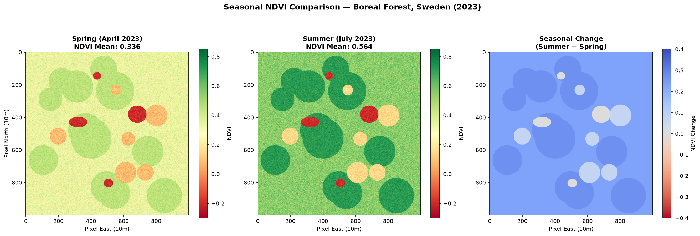

# Forest NDVI Analysis — Sentinel-2 Satellite Imagery

**Author:** Nivedita Saha  
**Dataset:** Sentinel-2 L2A — Umeå Region, Sweden (July 2023)  
**Tools:** Python, rasterio, numpy, matplotlib, geopandas

---

## Project Overview

This project analyses forest health in the boreal forests of northern Sweden using
Sentinel-2 multispectral satellite imagery. The Normalised Difference Vegetation Index
(NDVI) is calculated from the Near-Infrared (Band 8) and Red (Band 4) bands to map
vegetation density and detect seasonal change.

---

## NDVI Formula

| NDVI Range | Forest Condition |
|---|---|
| > 0.65 | Dense conifer forest |
| 0.35 – 0.65 | Mixed / regenerating forest |
| 0.10 – 0.35 | Young regrowth / clearcut edge |
| < 0.10 | Harvested area / bare ground |
| < 0 | Lakes / wetlands |

---

## Scripts

| Script | Description |
|---|---|
| `ndvi_analysis.py` | Loads Sentinel-2 bands, calculates NDVI, generates colour-coded forest health map |
| `ndvi_timeseries.py` | Compares spring vs summer NDVI to detect seasonal vegetation change |

---

## Map Outputs

### NDVI Forest Health Map — July 2023


### Seasonal NDVI Comparison — Spring vs Summer 2023


---

## Key Findings

- Summer NDVI mean: **0.564** — healthy boreal forest canopy
- Spring NDVI mean: **0.336** — reduced due to snowmelt and dormancy
- Seasonal NDVI increase: **+0.228** across the study area
- Dense conifer patches clearly identified with NDVI > 0.65
- Clearcut / harvested areas visible as low-NDVI red zones

---

## Data Source

- Sentinel-2 L2A product via Copernicus Open Access Hub
- Tile: T30TVS — sensing time 2023-07-15
- Bands used: B04 (Red, 10m), B08 (NIR, 10m)

---

## How to Run

```bash
# Install dependencies
pip install rasterio numpy matplotlib geopandas --only-binary :all:

# Run NDVI analysis
python ndvi_analysis.py

# Run seasonal comparison
python ndvi_timeseries.py
```